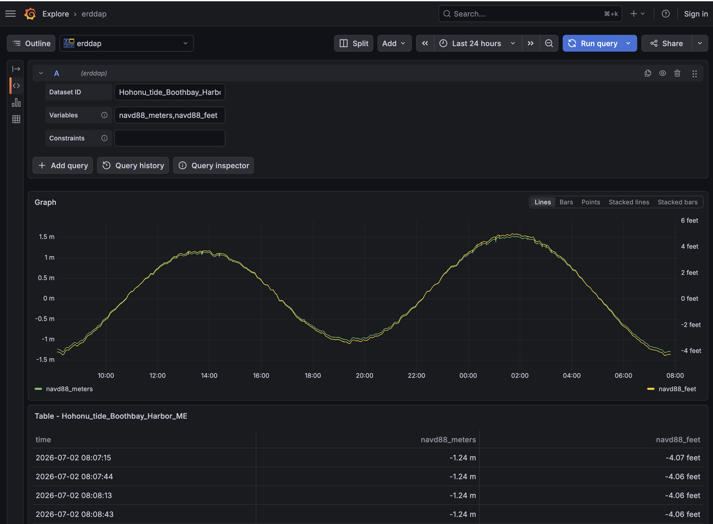

# Grafana ERDDAP data source plugin

This plugin lets [ERDDAP](https://www.ncei.noaa.gov/erddap/information.html) **tabledap** datasets act as
Grafana data sources. Queries are executed in the Go backend (not the browser), so this datasource also
works with Grafana alerting.



Only public ERDDAP servers are supported: there is no API key or credential handling, and requests are
made as anonymous GETs against the configured ERDDAP base URL.

## Configuration

The datasource has a single setting:

| Field           | Description                                                                                                                             |
| --------------- | --------------------------------------------------------------------------------------------------------------------------------------- |
| ERDDAP base URL | The root URL of the ERDDAP install, e.g. `https://data.neracoos.org/erddap` (no trailing slash needed — one is stripped automatically). |

Use the "Save & test" button on the datasource configuration page to verify Grafana can reach the server:
it issues a `GET {baseUrl}/version` request and checks the response looks like ERDDAP's version endpoint.

## Query editor

Each panel query has three fields:

| Field       | Required | Description                                                                                                                                                                                                 |
| ----------- | -------- | ----------------------------------------------------------------------------------------------------------------------------------------------------------------------------------------------------------- |
| Dataset ID  | Yes      | The tabledap dataset ID, e.g. `M01_sbe37_all`.                                                                                                                                                              |
| Variables   | Yes      | Comma-separated variable (column) names to request, e.g. `temperature, salinity`. `time` is always requested automatically and does not need to be listed — if you do include it, the duplicate is dropped. |
| Constraints | No       | A raw ERDDAP constraint expression, appended to the request as-is (after escaping), e.g. `station="A01"&depth<2`.                                                                                           |

### Worked example

For a dataset `M01_sbe37_all` with:

- Variables: `temperature, salinity`
- Constraints: `station="A01"&depth<2`
- Dashboard time range: the last 24 hours

the plugin sends this request (`>`, `<`, and `"` are percent-encoded; `&`, `,`, and `=` are left literal since
ERDDAP uses them as query-string structure):

```
GET {baseUrl}/tabledap/M01_sbe37_all.json?time,temperature,salinity&time%3E=2026-07-01T12:00:00Z&time%3C=2026-07-02T12:00:00Z&station=%22A01%22&depth%3C2
```

The response is returned as a single Grafana time series frame with one field per requested variable, plus
`time`.

### Time range

The dashboard's time range is always translated into `time>=<from>&time<=<to>` constraints, using RFC3339
timestamps in UTC (`Z` suffix). There is no way to omit the time range from a query.

### Quoted values: special characters are escaped automatically

The Constraints field understands raw ERDDAP constraint syntax, including double-quoted string values
(e.g. `station="A01"`). The plugin tracks quote state while escaping: a literal `&` (or `,`, `(`, `)`,
`:`, `/`, etc.) typed _inside_ a quoted value is percent-encoded automatically, so it can't be mistaken
for the `&` that separates constraints — no manual pre-encoding needed. For example,
`station="A&B"&depth<2` is sent as `station=%22A%26B%22&depth%3C2`. The same characters left _outside_
quotes keep their structural meaning (`&` separates constraints, `,` separates variable names, etc.).

### No matching results

If ERDDAP reports that a query is valid but matches no rows, the plugin returns an empty result rather
than an error — panels will show "No data" instead of an error state.

### Quality-flag value mappings

If a requested variable declares both the CF `flag_values` and `flag_meanings` attributes (as
QARTOD quality-control variables typically do, e.g. `flag_meanings="GOOD UNKNOWN SUSPECT FAIL MISSING"`),
the plugin fetches that information from `{baseUrl}/info/{datasetID}/index.json` and attaches Grafana
value mappings to the field: `1` renders as "GOOD" (green), `3` as "SUSPECT" (orange), and so on. The
underlying values remain numeric, so the field can still be plotted as a time series; tables, stat
panels, and state timelines display the mapped text and color instead of the raw number. This metadata
is cached per datasource instance for one hour. If the metadata can't be fetched or parsed, the query
still succeeds — the field is just left without mappings.

## Development

```bash
npm install          # install frontend dependencies
npm run dev           # build the frontend in watch mode
npm run build         # production frontend build
mage -v               # build the Go backend (requires Go and mage)
go test ./...         # backend unit tests
npm run test:ci       # frontend unit tests
npm run server        # run a Grafana instance in Docker with this plugin loaded (localhost:3000)
npm run e2e           # end-to-end tests (run `npm run server` first)
```

The backend binary is only rebuilt by `mage -v`; after rebuilding it, restart the Grafana container (e.g.
`npm run server` again) to pick up the new binary.

To check against the minimum supported Grafana version:

```bash
GRAFANA_VERSION=12.3.0 npm run server
```
