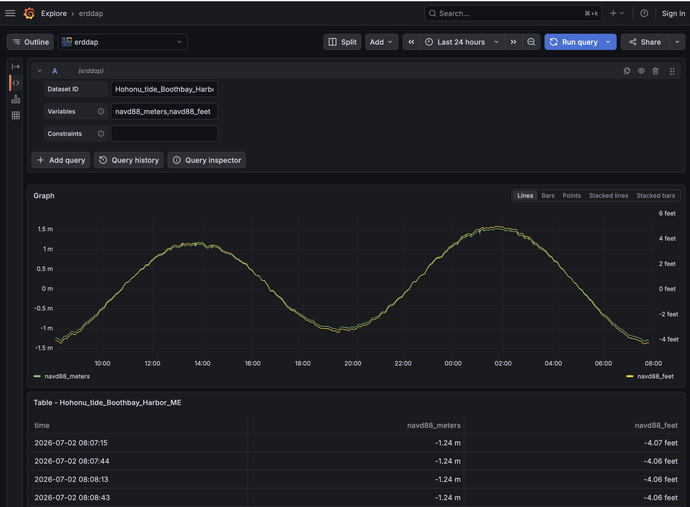

# Grafana ERDDAP data source plugin

This plugin lets [ERDDAP](https://www.ncei.noaa.gov/erddap/information.html) **tabledap** datasets act as
Grafana data sources. Queries are executed in the Go backend (not the browser), so this datasource also
works with Grafana alerting.



Only public ERDDAP servers are supported: there is no API key or credential handling, and requests are
made as anonymous GETs against the configured ERDDAP base URL.

## Configuration

The datasource has a single setting:

| Field           | Description                                                                                                                             |
| --------------- | --------------------------------------------------------------------------------------------------------------------------------------- |
| ERDDAP base URL | The root URL of the ERDDAP install, e.g. `https://data.neracoos.org/erddap` (no trailing slash needed — one is stripped automatically). |

Use the "Save & test" button on the datasource configuration page to verify Grafana can reach the server:
it issues a `GET {baseUrl}/version` request and checks the response looks like ERDDAP's version endpoint.

## Query editor

Each panel query has three fields:

| Field       | Required | Description                                                                                                                                                                                                 |
| ----------- | -------- | ----------------------------------------------------------------------------------------------------------------------------------------------------------------------------------------------------------- |
| Dataset ID  | Yes      | The tabledap dataset ID, e.g. `M01_sbe37_all`.                                                                                                                                                              |
| Variables   | Yes      | Comma-separated variable (column) names to request, e.g. `temperature, salinity`. `time` is always requested automatically and does not need to be listed — if you do include it, the duplicate is dropped. |
| Constraints | No       | A raw ERDDAP constraint expression, appended to the request as-is (after escaping), e.g. `station="A01"&depth<2`.                                                                                           |

### Worked example

For a dataset `M01_sbe37_all` with:

- Variables: `temperature, salinity`
- Constraints: `station="A01"&depth<2`
- Dashboard time range: the last 24 hours

the plugin sends this request (`>`, `<`, and `"` are percent-encoded; `&`, `,`, and `=` are left literal since
ERDDAP uses them as query-string structure):

```
GET {baseUrl}/tabledap/M01_sbe37_all.json?time,temperature,salinity&time%3E=2026-07-01T12:00:00Z&time%3C=2026-07-02T12:00:00Z&station=%22A01%22&depth%3C2
```

The response is returned as Grafana time series frames: a `time` field plus one numeric field per
requested numeric variable. See [String variables become labels](#string-variables-become-labels) for
how non-numeric variables are handled.

### String variables become labels

Non-numeric (ERDDAP `String`) variables such as `station` are not returned as fields. Instead, rows are
partitioned by their combined String values into one frame per distinct combination, and those values
become Grafana **labels** on the numeric fields. Requesting `station, air_temperature` from a dataset
covering two stations therefore yields two series — `air_temperature {station="A01"}` and
`air_temperature {station="B01"}` — rather than one field with the stations interleaved at duplicate
timestamps.

This is also what makes the datasource usable for alerting: Grafana's expression engine only accepts
_wide_ time series (a time field plus numeric fields), and rejects a frame carrying a String field
alongside `time` with "input data must be a wide series".

One consequence: because String variables are labels rather than columns, they no longer appear as
columns in a table panel.

### Time range

The dashboard's time range is always translated into `time>=<from>&time<=<to>` constraints, using RFC3339
timestamps in UTC (`Z` suffix). There is no way to omit the time range from a query.

### Quoted values: special characters are escaped automatically

The Constraints field understands raw ERDDAP constraint syntax, including double-quoted string values
(e.g. `station="A01"`). The plugin tracks quote state while escaping: a literal `&` (or `,`, `(`, `)`,
`:`, `/`, etc.) typed _inside_ a quoted value is percent-encoded automatically, so it can't be mistaken
for the `&` that separates constraints — no manual pre-encoding needed. For example,
`station="A&B"&depth<2` is sent as `station=%22A%26B%22&depth%3C2`. The same characters left _outside_
quotes keep their structural meaning (`&` separates constraints, `,` separates variable names, etc.).

### No matching results

If ERDDAP reports that a query is valid but matches no rows, the plugin returns an empty result rather
than an error — panels will show "No data" instead of an error state.

### Quality-flag value mappings

If a requested variable declares both the CF `flag_values` and `flag_meanings` attributes (as
QARTOD quality-control variables typically do, e.g. `flag_meanings="GOOD UNKNOWN SUSPECT FAIL MISSING"`),
the plugin fetches that information from `{baseUrl}/info/{datasetID}/index.json` and attaches Grafana
value mappings to the field: `1` renders as "GOOD" (green), `3` as "SUSPECT" (orange), and so on. The
underlying values remain numeric, so the field can still be plotted as a time series; tables, stat
panels, and state timelines display the mapped text and color instead of the raw number. This metadata
is cached per datasource instance for one hour. If the metadata can't be fetched or parsed, the query
still succeeds — the field is just left without mappings.

## Dashboard variables

### Which fields interpolate

Dashboard template variables are substituted into two of the three query fields:

| Field       | Interpolated | Example                                          |
| ----------- | ------------ | ------------------------------------------------ |
| Constraints | Yes          | `station="$station"&depth<$maxdepth`             |
| Variables   | Yes          | `$measurements` → `temperature,salinity`         |
| Dataset ID  | No           | `$dataset` is sent to ERDDAP as the literal text |

Dataset ID is left alone on purpose: a query targets exactly one dataset, and Grafana's panel **repeat**
option already produces one panel per value without needing interpolation in the field itself.

### Single-value vs. multi-value: use `=~` for multi-select

This is the one thing worth getting right. ERDDAP's tabledap has **no OR operator**, so a
comma-separated or brace-wrapped list is meaningless in a constraint. ERDDAP's documented substitute is
a regex match (`=~`) against an alternation, and that is what the plugin produces:

| Variable selection    | Constraint you write  | Sent to ERDDAP          |
| --------------------- | --------------------- | ----------------------- |
| Single value `A01`    | `station="$station"`  | `station="A01"`         |
| Multi-value `A01,B01` | `station=~"$station"` | `station=~"(A01\|B01)"` |

Writing `station="$station"` with a multi-value selection produces `station="(A01|B01)"`, which matches
nothing — `=` is an exact string comparison. If a variable is set to "Multi-value" or "Include All
option", write the constraint with `=~`. Using `=~` with a single-valued variable also works, since a
plain value is a valid regex, so `=~` is the safe default for any variable that might become multi-value
later.

A single value is deliberately **not** regex-escaped, which keeps numeric comparisons usable:
`depth<$maxdepth` with a value of `2.5` is sent as `depth<2.5`, not `depth<2\.5`.

### Multi-value in the Variables field

The Variables field is already comma-separated, so a multi-value variable expands there as a plain comma
list: `$measurements` with `temperature` and `salinity` selected becomes `temperature,salinity`.

### Special characters

Quotes and backslashes inside a variable's value are escaped automatically, so a station named `A"B`
cannot break out of the quoted value. ERDDAP's structural characters (`&`, `,`, `(`, `)`) are left as-is
in the substituted text and then handled by the backend's constraint escaper, exactly as they would be
for a hand-typed value — see
[Quoted values: special characters are escaped automatically](#quoted-values-special-characters-are-escaped-automatically).

### Format overrides

Grafana's inline format syntax still works and takes precedence over the plugin's formatter, for the
cases where you want something other than a regex alternation:

```
${station:csv}     A01,B01
${station:pipe}    A01|B01
${station:raw}     the value with no escaping at all
```

### Query variables

To populate a variable from the ERDDAP server itself, go to **Dashboard settings → Variables → New
variable**, choose type **Query**, and select this datasource. The editor asks for:

- **Dataset ID** — the tabledap dataset ID, e.g. `M01_sbe37_all`
- **Variable** — the variable whose values become the options, e.g. `station`
- **Constraints** — optional, see below

All three fields are interpolated themselves, so one variable can depend on another: a `$station`
variable can take `$dataset` as its Dataset ID.

Values come from ERDDAP's `distinct()` feature, so they arrive already sorted and deduplicated by the
server; the plugin does not reorder them.

A hand-authored dashboard JSON can also give the variable's query as the string `"datasetId.variable"`
(e.g. `"M01_sbe37_all.station"`) instead of the object form. Both resolve identically.

**The dashboard time range is not applied.** A query variable lists every distinct value in the dataset,
not just those within the current time window — the values would otherwise churn every time the time
picker moved. Use the Constraints field as the escape hatch if you want a narrower list, e.g.
`time>=2024-01-01`.

## Alerting

Queries are executed in the Go backend rather than the browser, and every frame the backend returns is a
wide time series, so ERDDAP queries can be used directly as alert rule queries. The datasource
configuration page shows **Alerting: Supported**.

Build a rule the same way as any other datasource: an ERDDAP query as refId `A`, then a `reduce` and a
`threshold` expression over it.

Two things to keep in mind when writing alert queries:

- **Pin numeric dimensions with a constraint.** Only String variables become labels. Numeric dimension
  variables — `depth`, `latitude`, `longitude` — cannot, so rows differing only by depth collapse into
  one series with duplicate timestamps. Constrain them explicitly (e.g. `depth<2`) so the rule
  evaluates a single physical series.
- **A query that matches no rows evaluates to NoData**, not to an error, so set the rule's "No data"
  handling to match your intent.
- **Dashboard template variables are not available to alert rules.** Interpolation happens in the
  browser, but alert rules are evaluated server-side with no dashboard context, so a `$station` in an
  alert query reaches ERDDAP as the literal string `$station` and the query errors. Hardcode the values
  in alert rule queries.

## Development

```bash
npm install          # install frontend dependencies
npm run dev           # build the frontend in watch mode
npm run build         # production frontend build
mage -v               # build the Go backend (requires Go and mage)
go test ./...         # backend unit tests
npm run test:ci       # frontend unit tests
npm run server        # run a Grafana instance in Docker with this plugin loaded (localhost:3000)
npm run e2e           # end-to-end tests (run `npm run server` first)
```

The backend binary is only rebuilt by `mage -v`; after rebuilding it, restart the Grafana container (e.g.
`npm run server` again) to pick up the new binary.

To check against the minimum supported Grafana version:

```bash
GRAFANA_VERSION=12.3.0 npm run server
```
